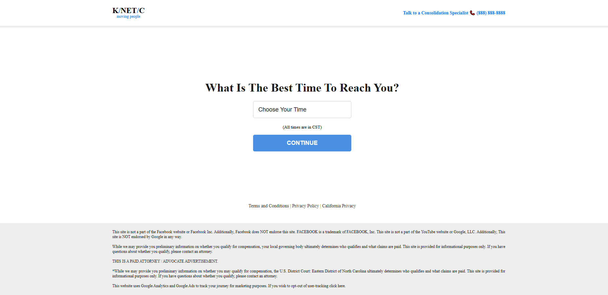
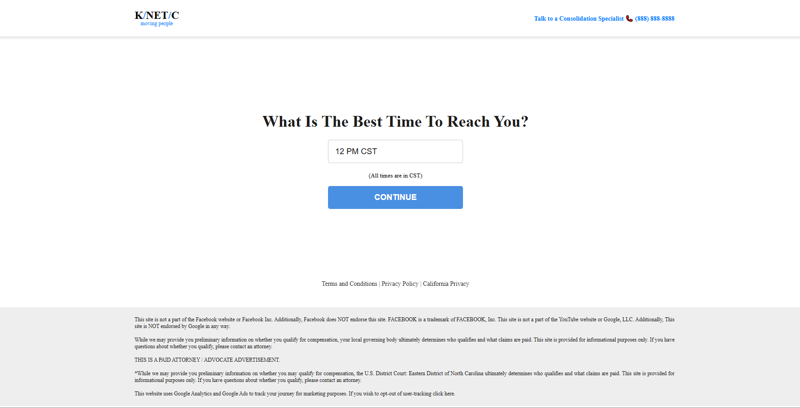
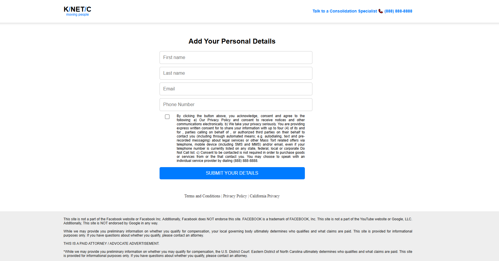
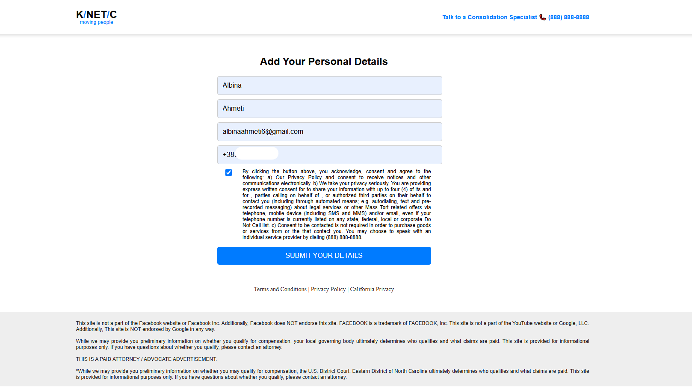
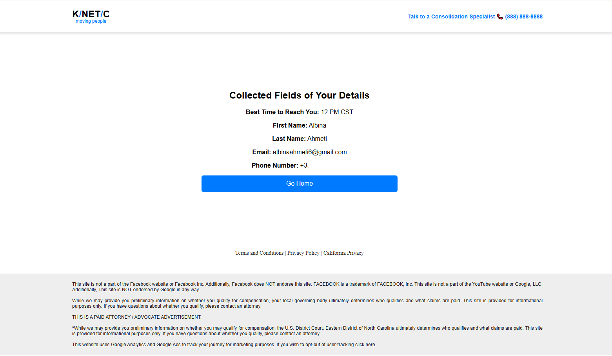

# ThreeStepForm-
ThreeStepForm is an interactive website designed to guide users through a simple three-step process. First, they select a suitable time, then they fill in their personal details, and finally, all the collected information is displayed on the screen. This project ensures a clear and intuitive flow for gathering user data efficiently and effortlessly.

# STEP 1

# STEP 2

# STEP 3

